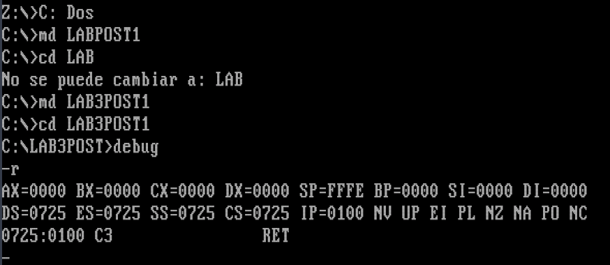
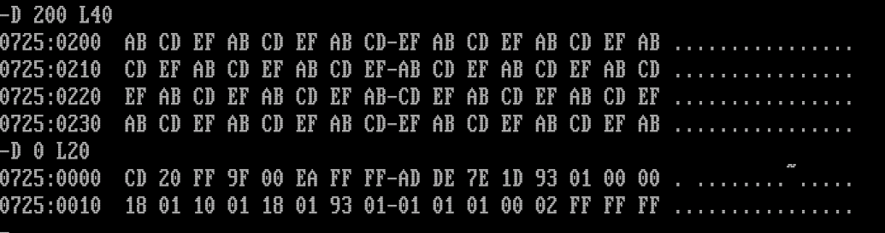
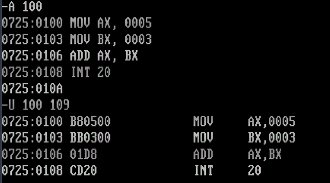

# ardila-post1-u3

**Arquitectura de Computadores · Ingeniería de Sistemas · 2026**

Laboratorio de exploración del depurador DEBUG en DOSBox. Se utilizaron los comandos `R`, `F`, `D`, `A` y `U` para inspeccionar registros, manipular memoria y ensamblar/desensamblar instrucciones x86.

---

## Checkpoint 1 — Registros (`R`)

Se ejecutó `-R` al iniciar DEBUG. Los registros `AX`, `BX`, `CX` y `DX` aparecen en `0000`, los cuatro registros de segmento apuntan al mismo párrafo del PSP y el `IP` se ubica en `0100`, que es la primera dirección ejecutable después del PSP.

---

## Checkpoint 2 — Volcado de memoria (`F` y `D`)

Se rellenaron 64 bytes a partir de `DS:0200` con el patrón `AB CD EF` usando `-F 200 L40 AB CD EF`, y se verificó con `-D 200 L40`.

La salida del comando `D` tiene tres columnas: la dirección en formato `segmento:offset`, los valores de 16 bytes en hexadecimal agrupados en dos bloques de 8, y una representación ASCII donde los bytes no imprimibles aparecen como puntos. Los valores `AB`, `CD` y `EF` caen fuera del rango ASCII imprimible (`0x20`–`0x7E`), por eso la columna derecha muestra solo puntos.

---

## Checkpoint 3 — Ensamblado y desensamblado (`A` y `U`)

Se escribió un programa de 4 instrucciones con `-A 100` y se verificó con `-U 100 109`. Cada instrucción tiene su codificación en bytes: `MOV AX,0005` → `B8 05 00`, `MOV BX,0003` → `BB 03 00`, `ADD AX,BX` → `01 D8`, `INT 20` → `CD 20`. Los inmediatos se almacenan en little-endian. El programa completo ocupa 10 bytes.
